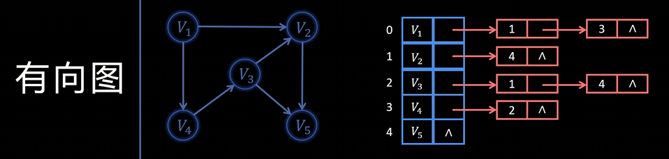
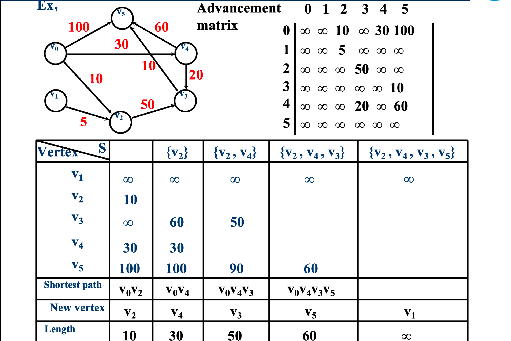
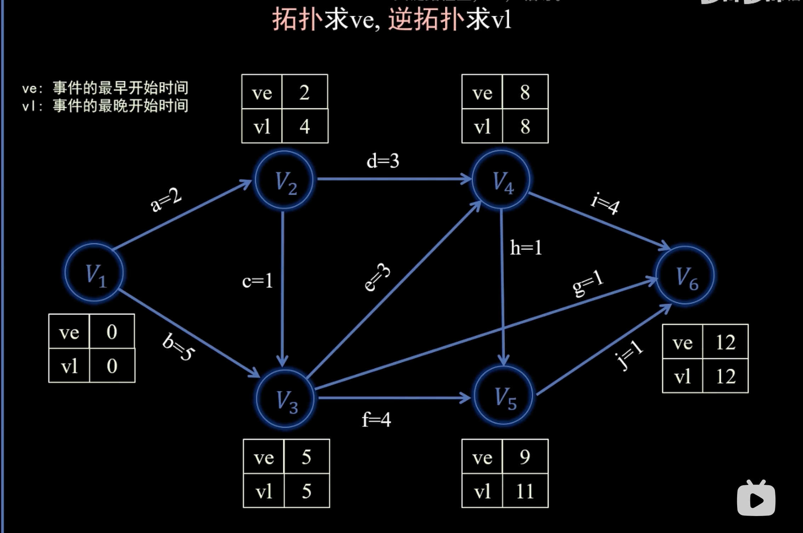
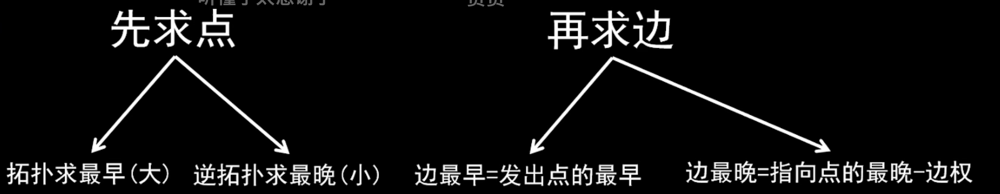
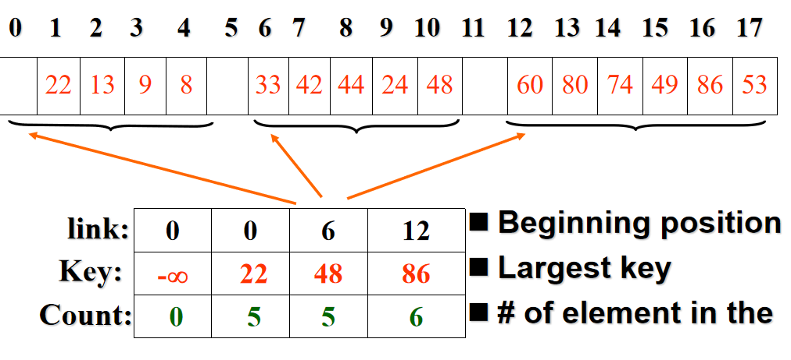

# 数据结构与算法-笔记
## 图
简单路径：同一个点只包含一次  

简单环：简单路径的情况下围成一个圈，删去最后一个重复的节点。  

连通图：任意两个点之间都有路径链接  

子图：不可以使用同一条边两次及以上  


分量：在一个无向图里，如果你从某个顶点出发，沿着边一直走下去，能到达的所有顶点（以及这些顶点之间的边）共同组成一个**连通分量**（**每个连通图仅仅有一个连通分量**）。  
无环图（acyclic graph）是指不包含任何回路的图。 

树（tree）是无环且连通的图。  

若若干棵树互不相交（彼此没有公共顶点），它们的集合称为森林（forest）。 

连通图的**生成树**（spanning tree）是一个包含该图所有顶点、并且本身是一棵树的子图。 

一个图的**生成森林**（spanning forest）是该图各个连通分量的生成树的并集。

生成树：一个包含这个图所有顶点的子树。（边=顶点-1，连通图的生成树不唯一）  

共享点的边相邻（adjacent），共享边的点相邻；
### 无向图的特殊性质
每条边的形式为 (u, v)，其中 u ≠ v。  

在一个含有 n 个顶点的图中，可能的顶点对共有 n×(n−1) 个。  

由于在无向图中，(u, v) 与 (v, u) 表示的是同一条边，因此无向图中最多有 n×(n−1)/2 条边。  

换句话说，无向图的边数不超过 n×(n−1)/2。

### 有向图的特殊性质 
每条边的形式为 (u, v)，其中 u ≠ v。  

在一个具有 n 个顶点的图中，可能的顶点对共有 n×(n−1) 个。

由于在有向图中，(u, v) 与 (v, u) 表示的是不同的两条边，  因此有向图中最多可以有 n×(n−1) 条边。  

换句话说，有向图的边数不超过 n×(n−1)。  

indegree（入度） outdegree（出度） 总和相等

```
class Graph{  //图的ADT
	public:	               
 	int VerticesNum(); //返回图的顶点个数  
 	int EdgesNum();    //返回图的边数  
 	//返回与顶点oneVertex相关联的第一条边  
 	Edge FirstEdge(int oneVertex);  
 	//返回与边PreEdge有相同关联顶点oneVertex的下一条边  
 	Edge NextEdge(Edge preEdge);   
    //添加一条边
    bool setEdge(int fromVertex,int toVertex,int weight);  
    //删一条边
    bool delEdge(int fromVertex,int toVertex);
    //如果oneEdge是边则返回TRUE，否则返回FALSE
    bool IsEdge(Edge oneEdge); 
    //返回边oneEdge的始点
    int FromVertex(Edge oneEdge);  
    //返回边oneEdge的终点
    int ToVertex(Edge oneEdge);    
    //返回边oneEdge的权
    int Weight(Edge oneEdge);	
    }; 
```
binary-relation list  
example: {(1, 2), (1, 4), (3, 5), (4, 2), (4, 5), (5, 2), (5, 3), (5, 8), (6, 9), (7, 9), (8, 4)}  
Adjacency Matrix  有向图的纵坐标是出，横坐标是入；
example:   
  
if for a weight graph（边上带权）  
  
表示邻接矩阵需要n^2个字节的存储空间。对于无向图，可以只存储矩阵的下三角或上三角部分（不包括对角线）  
在邻接矩阵中，求某个顶点的度数或找出与该顶点相邻的顶点，所需时间复杂度为 O(n)。  

邻接表结构：


**space = a*V + b*E**

**space = a*V + 2*b*E**  
a是数组占用，b是链表占用  

正交表结构：  
1️⃣ 顶点结点（Head node）

每个顶点有一个头节点，包含三部分：

vexinfo：存放顶点本身的信息（比如名字或编号）

firstin：指向以该顶点为终点（入边）的第一条边

firstout：指向以该顶点为起点（出边）的第一条边

2️⃣ 边结点（List node）

每一条边在图中是一个独立的结点，包含六个字段：

tailvex：该边的起点

headvex：该边的终点

arcinfo：该边的额外信息（如权重）

tnext：指向具有相同起点的下一条边（下一条出边）

hnext：指向具有相同终点的下一条边（下一条入边）  

拓扑序列是我们有向图的一个按照图中指向先后顺序的序列；

arc（弧）是直接链接的意思。

### DFS ###
设图 
𝐺 有 n 个顶点，用邻接矩阵表示时，深度优先搜索（DFS）遍历的时间复杂度为 
𝑂(𝑛2)。
若图 G 有 n 个顶点和 𝑚条边，并用邻接表表示，则 DFS 遍历的时间复杂度为𝑂(𝑛+𝑚)。

### BFS ###
设图 𝐺有 𝑛个顶点和 𝑚条边，并用邻接表表示。对 𝐺进行一次广度优先搜索（BFS）遍历的时间复杂度为 𝑂(𝑛+𝑚)。

### 最小生成树 ###
Prim 和 Kruskal 都是用于求**最小生成树（Minimum Spanning Tree, MST）**的经典算法。
最小生成树是指在一个连通无向加权图中，选出若干条边，使所有顶点连通且边的权值总和最小。

一、Prim 算法（普里姆算法）

思想：从一个顶点开始，不断扩展“当前生成树”，每次选择一条连接树内顶点和树外顶点的最小边。

有点像修路：你从一个城市出发，每次选择最近的城市连接起来，直到所有城市都连通。

核心步骤：

从任意一个顶点开始，加入到生成树集合中；

在所有“一个端点在树中，另一个端点不在树中”的边中，选出权值最小的那条；

把这条边和它的另一个顶点加入生成树；

重复步骤 2 和 3，直到所有顶点都被包含。

时间复杂度：

用邻接矩阵实现：O(V²)；

用最小堆（优先队列）和邻接表实现：O(E log V)。

适合的场景：
适用于稠密图（边较多），因为每次主要是从邻接边里选最小的。

例子：
```
  A
 / \
1   2
/     \
B——3——C
```

从 A 出发：

选边 A–B (1)

再选边 A–C (2)
→ MST = {(A,B),(A,C)}, 权重 = 3

二、Kruskal 算法（克鲁斯卡尔算法）

思想：从边的角度出发，将所有边按权值从小到大排序，依次尝试加入生成树，但要避免形成环。

这像是修铁路：先选最短的路段连起来，但不能让线路绕成圈。

核心步骤：

把所有边按权值从小到大排序；

依次从小到大考虑每条边：

如果这条边连接的两个顶点属于不同的连通分量（即不会形成环），就加入生成树；

否则跳过；

当加入的边数达到 V-1（V为顶点数）时结束。

关键工具：

使用 并查集（Union-Find） 来判断两个顶点是否属于同一个连通分量。

时间复杂度：

排序边 O(E log E)

并查集合并查找近似 O(1)

总体约 O(E log E)

适合的场景：
适用于稀疏图（边较少），因为排序和合并相对更高效。

三、对比总结

| 特点 | Prim | Kruskal |
|------|-------|----------|
| 出发点 | 任意顶点 | 任意边 |
| 核心操作 | 不断扩展生成树 | 逐步合并分量 |
| 是否需排序边 | 否 | 是 |
| 是否需并查集 | 否 | 是 |
| 适合图类型 | 稠密图 | 稀疏图 |
| 时间复杂度 | O(E log V) 或 O(V²) | O(E log E) |

四、类比记忆

Prim：像“树长出来”——每次选最近的叶子继续生长。

Kruskal：像“拼图”——从最小的拼块（边）开始，一块一块拼起来，避免形成环。

在Kruskal算法中并查集的核心功能

并查集（Union–Find Disjoint Set）提供两个基本操作：

Find(x)：
查找元素 x 所属集合的“代表”或“根节点”。
— 也就是找出它属于哪一个分组。

Union(x, y)：
合并 x 和 y 所在的两个集合，使它们成为同一个集合。

Find 是“查关系”，Union 是“连起来”。

word tips ： **annulus**-**环图**

### 最短路径 ###

Dijkstra 算法的步骤可以简要概括为：

1. **初始化**：源点距离设为 0，其他顶点设为 ∞。
2. **选点**：从未确定的顶点中选出距离最小的一个。
3. **松弛**：用该顶点更新其所有邻接点的最短距离。
4. **重复**：直到所有顶点的最短路径都确定。

下面这两个算法不能适用于权值为负的情况  
#### Dijkstra 算法 与prim（最小生成树）的核心思想一致，每次找距离源点的路径最短的点，每次进行更新。

时间复杂度  
朴素实现（邻接矩阵 + 线性查找最小距离）：𝑂(𝑛^2)  
使用最小堆（优先队列）+ 邻接表优化（常见于稀疏图）：O((n+m)logn)，其中 n 为顶点数，m 为边数。  
空间复杂度  
需要存储邻接表/邻接矩阵，以及距离数组、访问标记：O(n+m)（邻接表）或 O(n^2)（邻接矩阵）。  

#### Floyd 算法 使用path和cost两个表格记录中转点 来逐步更新shortest path

时间复杂度：三层循环：O(n^3)

空间复杂度：存储距离矩阵：O(n^2)

#### 拓扑排序 ####
在**有向无环图**中才能进行-判断有向图是否有环的方法（深度优先遍历也可以）每次找入度为0的点，删掉这个点以及它的出边


### AOE网络和关键路径 ###

AOE activity on edge  
关键路径-整个工程中耗时最长的路径  
关键活动-不能拖延的活动-最早开始时间=最晚开始时间 
 


关键活动：e=l   
关键路径：最耗时的   
求ve：拓扑，ve用最大的数值   
求vl：逆拓扑，vl用最小的数值   
求e：由谁发出用谁的ve   
求l：指向谁，用谁的vl减去用时   
如果有多个关键路径，要去覆盖这几条关键路径才能缩短工期

## 索引与查找

查找:查询某个关键字是否在（数据元素集合）表中的过程。也称作检索。  
主关键字:能够惟一区分各个不同数据元素的关键字  
次关键字:通常不能惟一区分各个不同数据元素的关键字  
查找成功:在数据元素集合中找到了要查找的数据元素  
查找不成功:在数据元素集合中没有找到要查找的数据元素  
静态查找:只查找，不改变数据元素集合内的数据元素  
动态查找:既查找，又改变（增减）集合内的数据元素  
静态查找表:静态查找时构造的存储结构  
动态查找表:动态查找时构造的存储结构  

### 静态查找 ##
--------
**Sequential search** **顺序搜索** 就是按数组走的 自己去推ASL以及O 成功以及不成功不一样

---
**binary search** **二分查找**  

数据要求：必须是有序表（顺序存储结构最常用）。

查找效率：每次将查找区间缩小一半。

成功或不成功时的比较次数 ≤ ⌈log₂(n+1)⌉

时间复杂度：O(log n)

空间复杂度：O(1)（迭代实现）或 O(log n)（递归实现）

缺点：插入、删除困难（需要保持有序）。

ppt写的这个
$$
ASL_{\text{success}} \approx \log_2(n + 1) - 1  
$$

#### **查找不成功时**

$$
ASL_{\text{unsuccessful}} \approx \log_2(n + 1)
$$

或取整形式：

$$
ASL_{\text{unsuccessful}} = \lceil \log_2(n + 1) \rceil
$$

#### **时间复杂度**

$$
T(n) = O(\log_2 n)
$$
----
**block search** **分块查找**


#### 分块查找的平均查找长度（ASL）

分块查找分为两个层次：

1. **第一层（索引表查找）**
   在索引表中找到目标所在的块。
   查找时间记为：
   $$
   ASL_b
   $$
2. **第二层（块内查找）**
   在确定的块中顺序查找目标元素。
   查找时间记为：
   $$
   ASL_w
   $$
#### 综合平均查找长度公式

分块查找的总平均查找长度为两部分之和：

$$
\boxed{ASL(n) = ASL_b + ASL_w}
$$

其中：
* ( ASL_b )：查找索引表所需的平均比较次数（通常采用二分查找）；
* ( ASL_w )：块内顺序查找所需的平均比较次数。

$$
ASL(n) \approx \log_2(1 + \frac{n}{s}) + \frac{s}{2}
$$

### 动态查找
---
### 23树
* 左子树的所有键 < 节点最小键；
* 若为 3-节点，则中子树键介于两个键之间；
* 右子树的所有键 > 节点最大键。

所有叶子节点都处于同一深度，查找路径长度固定为树高 (h)。
时间复杂度：
$$
[
T_{\text{search}} = O(\log n)
]
$$

每个内部节点满足：
$$
\text{children count} = \text{key count} + 1
$$
| 节点类型 | 关键字数 | 子节点数 | 结构示例  |      |
| ---- | ---- | ---- | ----- | ---- |
| 2-节点 | 1    | 2    | `[K]` |      |
| 3-节点 | 2    | 3    | `[K₁  | K₂]` |

插入之后要保持平衡

设树中共有 (n) 个关键字：

* 最矮时（全为 3-节点）：
  $$[
  h_{\min} = \log_3 (n + 1)
  ]$$
* 最高时（全为 2-节点）：
  $$[
  h_{\max} = \log_2 (n + 1)
  ]$$    
$$
O(\log_3 n) \leq h \leq O(\log_2 n)
$$

* 每层最多比较 2 次关键字；
* 总比较次数上界约为$$2 \log_2 n$$
* 平均复杂度为$$O(\log n)$$


